<div align="center">


```
┌─────────────────────────────────────────────────────────────┐
│  █████╗ ██████╗ ██╗   ██╗███████╗██████╗ ███████╗██╗   ██╗ │
│ ██╔══██╗██╔══██╗██║   ██║██╔════╝██╔══██╗██╔════╝╚██╗ ██╔╝ │
│ ███████║██████╔╝██║   ██║█████╗  ██████╔╝█████╗   ╚████╔╝  │
│ ██╔══██║██╔══██╗╚██╗ ██╔╝██╔══╝  ██╔══██╗██╔══╝    ╚██╔╝   │
│ ██║  ██║██║  ██║ ╚████╔╝ ███████╗██║  ██║███████╗   ██║    │
│ ╚═╝  ╚═╝╚═╝  ╚═╝  ╚═══╝  ╚══════╝╚═╝  ╚═╝╚══════╝   ╚═╝    │
│                    ADITYA RATHORE                           │
└─────────────────────────────────────────────────────────────┘
```


**`FULL STACK ENGINEER`**  •  **`WEB3 ENGINEER`**  •  **`DEVOPS OPERATIVE`**  •  **`AI INFRASTRUCTURE`**

[](https://github.com/adirathoreudr)
[](https://github.com/adirathoreudr)
[](https://github.com/adirathoreudr)

</div>

---

### SYSTEM STATUS

```text
[████████████████████] ONLINE
LOCATION : ENCRYPTED  │  UPTIME : 24/7  │  STATUS : OPERATIONAL
```

---

### TECH STACK

```text
┌─────────────────────────────────────────────────────────────────────────────┐
│ FULL STACK      React · Next.js · Node.js · TypeScript · Tailwind · Prisma  │
│ WEB3            Solidity · Solana · ZK Compression · Token-2022 · Anchor    │
│ DEVOPS          AWS (EKS/VPC/Lambda) · Terraform · Docker · Jenkins · ArgoCD│
│ AI / AGENTS     LangChain · NVIDIA NIM · DeepSeek · ElevenLabs · Agents     │
│ DATA            PostgreSQL · MongoDB · Redis · FAISS · Vector DBs           │
│ OBSERVABILITY   Prometheus · Grafana · Loki · Tempo                         │
└─────────────────────────────────────────────────────────────────────────────┘
```

<div align="center">


</div>

---

### PORTFOLIO

<div align="center">

[**`adiisingh.xyz`**](https://adiisingh.xyz)  —  **Vogue magazine inspired portfolio**

</div>

---

### RECRUITMENT CHANNEL

```text
┌─────────────────────────────────────────────────────────────────┐
│  STATUS: OPEN TO WORK                                           │
│  ─────────────────────────────────────────────────────────────  │
│  ROLES      : Remote Full Stack / Web3 / DevOps & MLOps         │
│  AVAILABLE  : Freelance infra, contract builds, partnerships    │
│  LOCATION   : UTC+5:30 (IST)  │  Open to relocation             │
└─────────────────────────────────────────────────────────────────┘
```

<div align="center">

[](https://www.linkedin.com/in/adityarathoreudr)
[](mailto:adirathoreudr@gmail.com)
[](https://github.com/adirathoreudr)
[](https://x.com/adirathoreudr)
[](https://adiisingh.xyz)

[](./assets/AdityaRathore-Resume.pdf)

</div>

---

<div align="center">



```text
[==== CONNECTION TERMINATED ====]
```

<sub>last sync: 2026.07 // always compiling</sub>

</div>