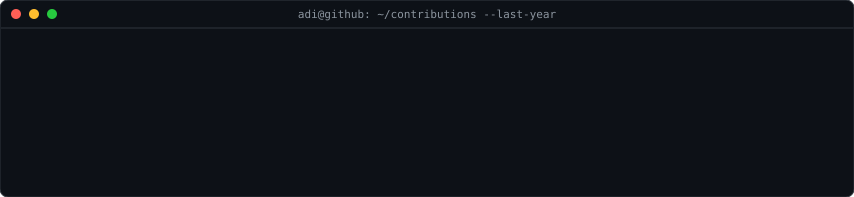
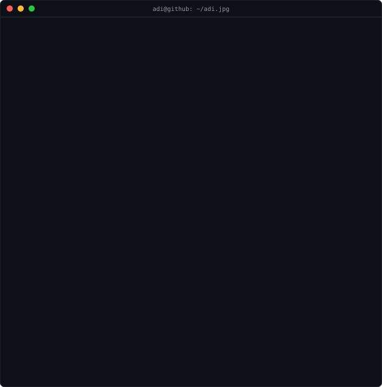
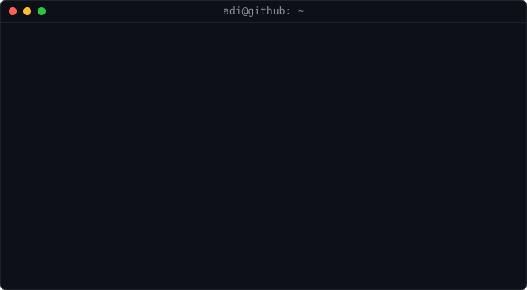

<h3><code>adi@github ~ $ ./contributions.sh</code></h3>

  

<h3><code>adi@github ~ $ whoami</code></h3>

<table>
  <tr>
    <td valign="top"></td>
    <td valign="top"></td>
  </tr>
</table>

 

<h3><code>adi@github ~ $ ./stats.sh</code></h3>

 

<h3><code>adi@github ~ $ ls /stack</code></h3>

  

<h3><code>adi@github ~ $ cat portfolio.txt</code></h3>

[**`adiisingh.xyz`**](https://adiisingh.xyz) — **Vogue magazine inspired portfolio**

 

<h3><code>adi@github ~ $ ./connect.sh</code></h3>

 

<code>[process completed] — all art is animated SVG, regenerated daily by a GitHub Actions cron · no tokens · no JavaScript</code>

